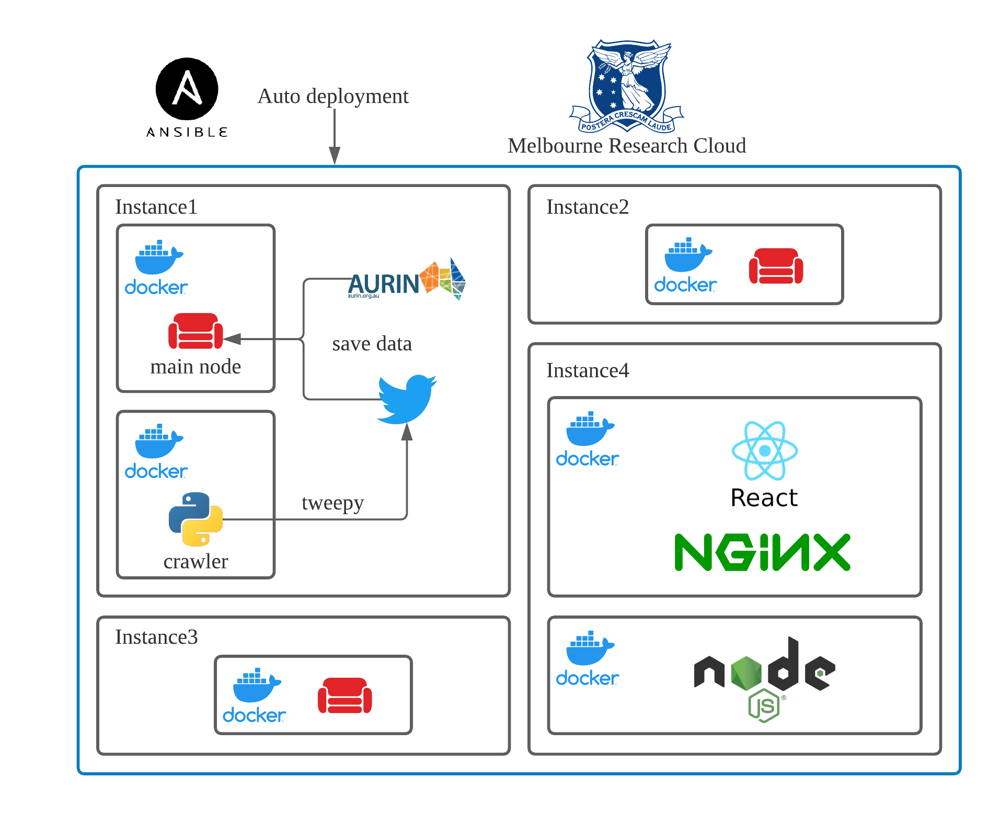

# CCC Group 26
<!-- ALL-CONTRIBUTORS-BADGE:START - Do not remove or modify this section -->
[](#contributors-)
<!-- ALL-CONTRIBUTORS-BADGE:END -->

## Contributors ✨

<!-- ALL-CONTRIBUTORS-LIST:START - Do not remove or modify this section -->
<!-- prettier-ignore-start -->
<!-- markdownlint-disable -->
<table>
  <tr>
    <td align="center"><a href="https://www.linkedin.com/in/yunfeijing/"><br /><sub><b>Yunfei Jing</b></sub></a><br /><a href="https://github.com/yunfeijing/ccc-p2/commits?author=yunfeijing" title="Code">💻</a></td>
    <td align="center"><a href="https://github.com/God-of-Study"><br /><sub><b>God-of-Study</b></sub></a><br /><a href="#data-God-of-Study" title="Data">🔣</a></td>
    <td align="center"><a href="https://github.com/matthewkkkk"><br /><sub><b>matthewkkkk</b></sub></a><br /><a href="https://github.com/yunfeijing/ccc-p2/commits?author=matthewkkkk" title="Code">💻</a></td>
    <td align="center"><a href="https://github.com/HarryHaoyuan"><br /><sub><b>Haoyuan Yu</b></sub></a><br /><a href="https://github.com/yunfeijing/ccc-p2/commits?author=HarryHaoyuan" title="Code">💻</a></td>
    <td align="center"><a href="https://github.com/echoid"><br /><sub><b>echoid</b></sub></a><br /><a href="#data-echoid" title="Data">🔣</a></td>
  </tr>
</table>

<!-- markdownlint-restore -->
<!-- prettier-ignore-end -->

<!-- ALL-CONTRIBUTORS-LIST:END -->


A Cloud-based application that exploits a multitude of virtual machines (VMs) across the UniMelb Research Cloud (Nectar) for harvesting tweets through the Twitter APIs. The application also include a front-end interface for visualizing our analysis and RESTFul API server for data accessing.

------


------

### Project Demonstration Video

- 

- Front-end Demo: https://www.youtube.com/watch?v=6bAEZ-dkEjM

- Presentation Slides: https://drive.google.com/file/d/1WXzDEVSrPxTZf1zl7YZ3ENYoYUbZItCA/view?usp=sharing  

## Getting Started

### Prerequisites

*The VMs we use are provided by UniMelb Research Cloud (Nectar), which is based on OpenStack. And the Ansible playbook in `ansible/playbooks` mainly use OpenStack modules to create machines on the Instance  Initialize Process. The following setting is based on UniMelb Research Cloud. You can change the code inside based on your cloud suppliers.*

#### Gain access from cloud providers

1. Login to [https://dashboard.cloud.unimelb.edu.au](https://dashboard.cloud.unimelb.edu.au)
2. Download openrc.sh from Dashboard
   - Make sure the correct project is selected
   - Download the OpenStack RC File in USER area
3. Reset API password
   - Dashboard -> User -> Settings -> Reset Password
4. Replace the `ansible/grp-26-openrc.sh` with your own one. We suggest changing the `OS_PASSWORD` to your API password so that you don't have to input it every time
5. Generate a ssh key pair in the cloud and put the private one to your `~/.ssh/`

#### Update access key

**Replace the `config/mrc_key.pem` with your own access key**

#### Install Ansible

##### Linux (Debian/Ubuntu)

```
sudo apt install ansible
```

##### MacOS

```
brew install ansible
```

For other operation system, you can check how to install it from [Installing Ansible Doc](https://docs.ansible.com/ansible/latest/installation_guide/intro_installation.html).

#### Set the Ansible variables

1. Open `ansible/host_vars/config.yaml`
2. Change the `ansible_ssh_private_key_file` to your own key path
3. Change any other variable based on your personal need

## Deployment

**Make sure the UniMelb VPN is configured and connected properly and follow the following steps.** 

```
cd ansible
```

#### Export constants

```
source ./grp-26-openrc.sh
```

#### Create instances

```
./create_instance.sh
```

#### Install Environment on the Cloud

```
./install_environment.sh
```

#### Deployment

```
./deplot_servers.sh
```

## Architecture




This project follows the [all-contributors](https://github.com/all-contributors/all-contributors) specification. Contributions of any kind welcome!
