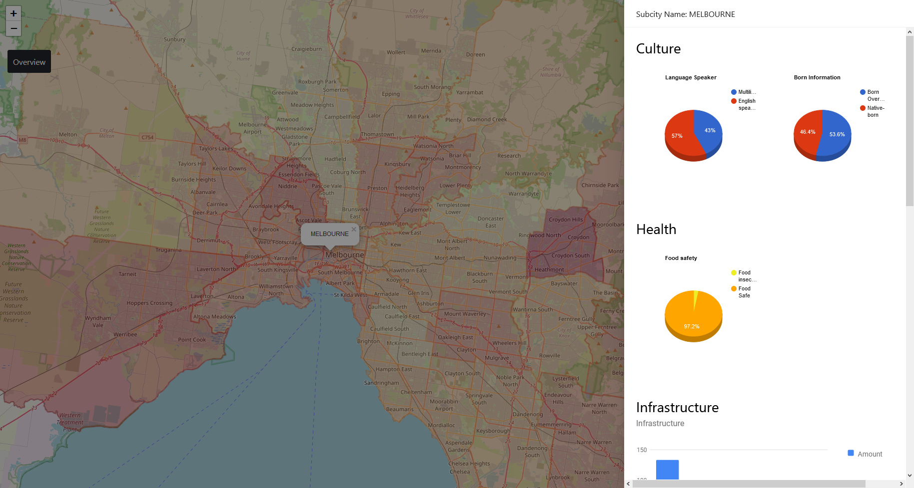

# COMP90024 Frontend

[http://172.26.132.181/](http://172.26.132.181/) (**UNIMELB VPN REQUIRED**)

The frontend website is built using ReactJS, showing an interactive map of Greater Melbourne Area with the statistic of many important features of each sub-region.



## Dependencies

- [React Google Charts](https://react-google-charts.com/) to draw the graphs
- [Leaflet](https://leafletjs.com/) to render the interactive map

## Installation

Get into the frontend folder 

```bash
cd web/frontend 
```
Use the package manager [npm](https://www.npmjs.com/) to install the frontend locally.

```bash
npm install
```

## Usage

### Prerequisites

- NodeJS

  For a better NPM version management, it is suggested to use the [Node Version Manager (NVM)](https://github.com/nvm-sh/nvm)

### Run on localhost

```
npm start
```

**This will start the frontend on [http://localhost:3000/](http://localhost:3000/), and any API requests will be forwarded to [http://localhost:8000/](http://localhost:8000/), make sure to start the backend server as well.**

### Build the package

```
npm run build
```

**This will build the static files ready to serve with API calling to http://localhost:8000/**

```
npm run build-prod
```

**Same as above but the API calling to the remote server http://172.26.132.181:8000/**

Modify the **package.json** to suit your needs.

## Contributing

Pull requests are welcome. For major changes, please open an issue first to discuss what you would like to change.

Please make sure to update tests as appropriate.

## License

[MIT](https://choosealicense.com/licenses/mit/)
